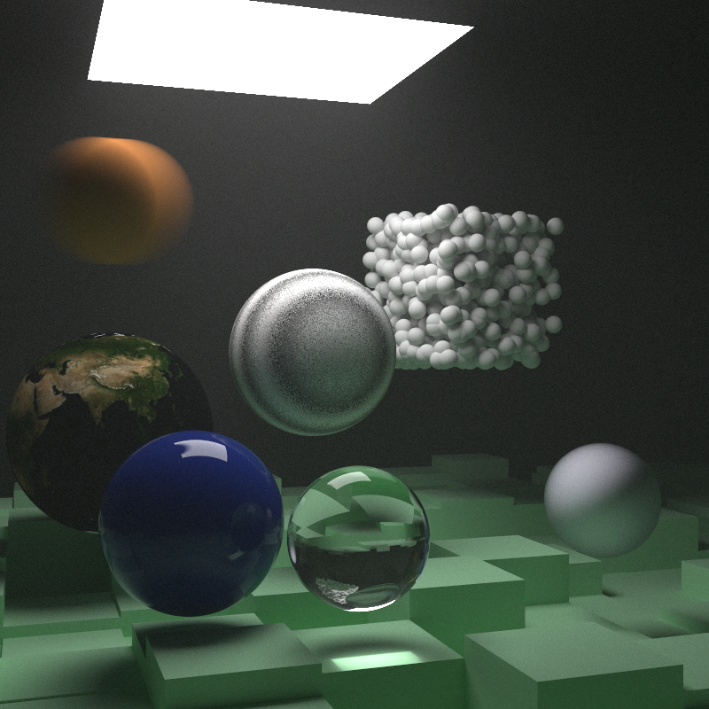
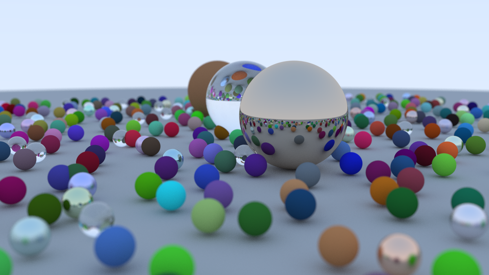
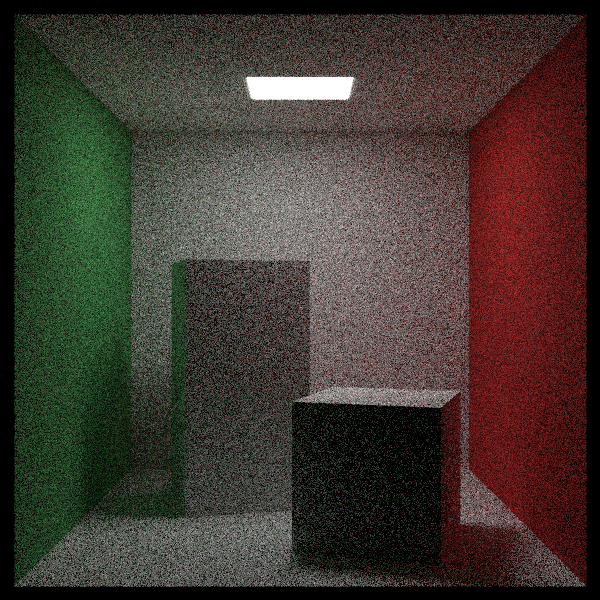
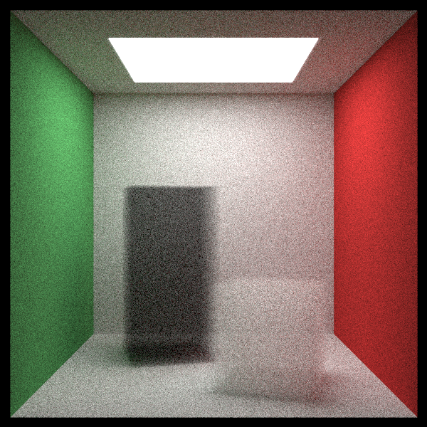

# Ray Tracer (CPU multithreaded)

A ray tracer written from scratch in C++17, following Peter Shirley's
[*Ray Tracing in One Weekend*](https://raytracing.github.io/) series.

This is the `cpu-multithreading` branch: the renderer from books 1 and 2
(*Ray Tracing in One Weekend* and *Ray Tracing: The Next Week*), parallelized
across all CPU cores with `std::thread`. The single-threaded version that
follows the books directly lives on [`main`](https://github.com/Harsha685/Ray_Tracer/tree/main).



| Book 1 final scene | Cornell box | Cornell box with smoke |
|:---:|:---:|:---:|
|  |  |  |

## Features

- **Math and output**
  - 3D vector math library with operator overloading (`vector3`)
  - PPM image output with gamma correction, converted to PNG
- **Shapes**
  - Spheres, including moving spheres for motion blur
  - Quadrilaterals (`quad`), and boxes built from six quads (`box()`)
  - Instances: `translate` and `rotate_y` move or rotate any object without
    copying its geometry
  - Constant-density volumes (`constant_medium`) for smoke, fog and mist
- **Acceleration**
  - Axis-aligned bounding boxes (`aabb`) with the slab test
  - Bounding volume hierarchy (`bvh_node`), so a ray tests about log n
    boxes instead of every object
- **Materials**
  - Lambertian (diffuse)
  - Metal with adjustable fuzz
  - Dielectric (glass) with refraction, total internal reflection and
    Schlick reflectance
  - Diffuse light (emissive surfaces)
  - Isotropic scattering inside volumes
- **Textures**
  - Solid color and 3D checkerboard
  - Image textures (loaded with [stb_image](https://github.com/nothings/stb)),
    mapped onto spheres and quads through (u, v) coordinates
  - Perlin noise with turbulence (marble)
- **Camera**
  - Positionable camera (`lookfrom`, `lookat`, `vup`, adjustable field of view)
  - Antialiasing by averaging jittered samples per pixel
  - Defocus blur (depth of field) via a thin-lens model
  - Motion blur: rays carry a random time in [0, 1)
  - Sky gradient or a flat background color, for scenes lit only by lights
  - Recursive ray bouncing with a configurable depth limit
- **Multithreaded rendering** with `std::thread`: rows are handed out through
  an atomic counter, and each thread has its own random number generator

## Multithreading

Every pixel is computed independently, so rendering parallelizes well. The
changes from the single-threaded version are all in `camera::render()` and
`random_double()`:

- **Frame buffer.** Pixels are written into a pre-sized `std::vector<color>`
  (pixel `(i, j)` at index `i * image_width + j`) instead of straight to
  stdout. Each thread writes only its own slots, so no locking is needed, and
  the image is written in order once every thread has finished.
- **Dynamic row scheduling.** Threads claim rows one at a time from a shared
  `std::atomic<int>` counter. Rows cost very different amounts (glass and
  metal bounce a lot, sky returns immediately), so threads that finish early
  just claim more rows instead of sitting idle.
- **Per-thread random number generators.** A single shared `std::mt19937`
  would be a data race, because every call updates its state. Each thread has
  its own `thread_local` generator. Seeds come from an atomic counter: the
  main thread always gets seed 0, so the randomly generated scene (and BVH)
  is identical on every run, and each render thread gets a different seed.
- **No shared reference counts in the hot path.** `hit_record` holds a plain
  `material*` instead of a `shared_ptr<material>`. Copying a `shared_ptr`
  updates an atomic reference count, and with every thread updating the same
  few counters on every ray hit, the threaded version was no faster than the
  single-threaded one. Removing it gave the speedup below.
- **Read-only scene.** Once the scene is built, every object, material and
  texture is only read during rendering, so threads share it without locks.

The code was checked for data races with ThreadSanitizer
(`-fsanitize=thread`).

## Benchmarks

Book 1 final scene (about 485 spheres), 1200×675, 500 samples per pixel,
max depth 100. Intel Core i7-13650HX (6 performance + 8 efficiency cores,
20 hardware threads), `g++ -O3 -march=native`, measured with
`hyperfine --runs 3`. These were measured before the book 2 features (BVH,
textures, lights) were merged in.

| Threads | Time | Speedup |
|--------:|-----:|--------:|
| 1  | 841.2 s ± 3.6 s (14 min 1 s) | 1.00× |
| 20 | 126.5 s ± 2.0 s (2 min 7 s)  | 6.65× |

The speedup is below 20× for three reasons:

- 12 of the 20 hardware threads are hyper-threads sharing 6 performance
  cores, and a pair of threads does far less than twice the work of one.
- 8 threads run on the slower efficiency cores.
- A sustained all-core load makes the laptop lower its clock speeds to stay
  within its power and temperature limits, while a single thread runs at
  full boost clock.

All 20 threads stay busy for the whole render (CPU time ÷ wall time ≈ 19.4),
so the remaining gap comes from the hardware, not from the threading.

## Building and running

Requirements: `g++` (C++17), `make`, and ImageMagick (for PNG conversion).

```bash
sudo apt install build-essential imagemagick
```

From the project root:

```bash
make view    # build, render, convert to PNG and open it
make run     # build and render only
make test    # build and run src/test.cpp
make clean   # remove build output
```

The renderer writes a PPM image to `build/image.ppm`, which is converted to a
timestamped PNG in `renders/` (`renders/render_YYYYMMDD_HHMMSS.png`).

`src/main.cpp` builds the book 2 final scene. Its arguments are set in
`main()`: `final_scene(image_width, samples_per_pixel, max_depth, thread_count)`.
The default of 800×800 at 10,000 samples per pixel is a final-quality render
and takes a long time; lower `samples_per_pixel` (e.g. to 50) for quick
previews. `thread_count` sets the number of render threads (0 uses one per
logical CPU core).

Image textures are loaded from `images/` (the renderer searches the current
directory, `images/`, and the `images/` folder of up to six parent
directories). Set the `RTW_IMAGES` environment variable to look in another
directory first.

To benchmark, build first and time only the renderer:

```bash
make && hyperfine --runs 3 './build/raytracer'
```

## Project structure

```
raytracer/
├── src/
│   ├── common.h           # shared constants, per-thread random numbers, common includes
│   ├── vec3.h             # vector3 class, point3 alias, vector math and sampling
│   ├── color.h            # color alias, gamma correction and pixel output
│   ├── ray.h              # ray: origin + t * direction, at a moment in time
│   ├── interval.h         # [min, max] ranges for hit tests, clamping and boxes
│   ├── AABB.h             # axis-aligned bounding box and the slab hit test
│   ├── hittable.h         # hit_record, the abstract hittable class, translate and rotate_y
│   ├── hittable_list.h    # a list of hittables treated as one object
│   ├── bvh.h              # bounding volume hierarchy
│   ├── sphere.h           # ray-sphere intersection and sphere (u, v) mapping
│   ├── quad.h             # ray-quad intersection and box()
│   ├── constant_medium.h  # constant-density volumes (smoke, fog)
│   ├── perlin.h           # Perlin noise and turbulence
│   ├── image_loader.h     # image file loading through stb_image
│   ├── texture.h          # solid color, checker, image and noise textures
│   ├── material.h         # lambertian, metal, dielectric, diffuse_light, isotropic
│   ├── camera.h           # camera setup, ray generation and the multithreaded render loop
│   ├── main.cpp           # scene setup (book 2 final scene)
│   ├── test.cpp           # debug output for the intersection math
│   └── external/
│       └── stb_image.h    # third-party image loader (v2.30, MIT or public domain)
├── docs/
│   ├── API_REFERENCE.md   # every type and function, file by file
│   ├── CALL_GRAPH.md      # what calls what, starting from main()
│   └── resources.md       # books and articles used
├── images/                # texture images (earth.jpg)
├── renders/               # saved output images
├── build/                 # compiled binaries and temporary images (git-ignored)
└── Makefile
```

## Documentation

- [docs/API_REFERENCE.md](docs/API_REFERENCE.md) lists every class, function
  and constant per source file along with its purpose.
- [docs/CALL_GRAPH.md](docs/CALL_GRAPH.md) shows which functions call which,
  and the hot path that dominates render time.
- [docs/resources.md](docs/resources.md) lists the books and articles used.
- Each function in `src/` has a block comment explaining what it does and
  the reasoning or math behind it.

## Roadmap

1. ~~*Ray Tracing in One Weekend*~~ (complete)
2. ~~Multithreading with `std::thread`, with benchmarks against the
   single-threaded version~~ (complete, this branch)
3. ~~*Ray Tracing: The Next Week* (BVH acceleration, textures, lights,
   instances, volumes), merged into this branch~~ (complete)
4. CUDA port, with CPU vs GPU benchmarks
5. *Ray Tracing: The Rest of Your Life* (Monte Carlo and importance sampling)

## Acknowledgments

Based on the [*Ray Tracing in One Weekend*](https://raytracing.github.io/)
book series by Peter Shirley, Trevor David Black and Steve Hollasch. Image
loading uses Sean Barrett's [stb_image](https://github.com/nothings/stb).
